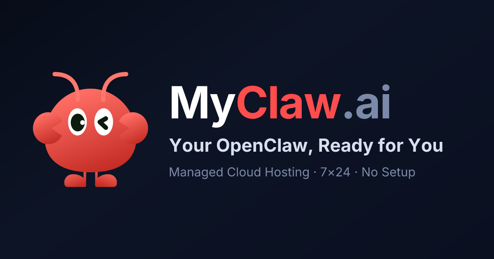

# 🦞 MyClaw.ai 🏆

**Votre serveur IA personnel. Contrôle total du code. Possibilités illimitées.**

  

[English](./README.md) · [中文](./README.zh-CN.md) · [Français](./README.fr.md) · [Deutsch](./README.de.md) · [Русский](./README.ru.md) · [日本語](./README.ja.md) · [Italiano](./README.it.md) · [Español](./README.es.md)

## Qu'est-ce que MyClaw.ai ?

MyClaw.ai offre à chaque utilisateur un serveur complet exécutant [OpenClaw](https://github.com/openclaw/openclaw) — la plateforme d'agents IA open source. Chaque instance est sous votre contrôle : déployez des skills, créez des automatisations, intégrez n'importe quelle API et gérez votre propre infrastructure IA.

**Fonctionnalités clés :**
- 🖥️ **Contrôle total du serveur** — Chaque instance est un déploiement OpenClaw complet
- 🤖 **Plateforme d'agents IA** — Créez, déployez et gérez des agents intelligents
- 🔧 **Autorité sur le code** — Accès complet au code source et à l'infrastructure
- 🌐 **Multi-instances** — Créez plusieurs instances pour différents projets
- 💾 **Mémoire persistante** — Gestion du contexte et des connaissances à long terme
- 🔌 **Extensible** — 100+ skills pré-construits via l'écosystème ClawHub
- 🚀 **Prêt pour la production** — Déployez des agents qui fonctionnent vraiment

## Démarrage rapide

1. **Inscrivez-vous** sur [myclaw.ai](https://myclaw.ai)
2. **Créez une instance** — Obtenez votre propre serveur OpenClaw
3. **Déployez un skill** — Choisissez sur ClawHub ou créez le vôtre
4. **Automatisez** — Laissez votre agent gérer les tâches

## Tarifs

| Plan | Mensuel | Annuel |
|------|---------|--------|
| **Lite** | 19$/mois | 199$/an |
| **Pro** | 39$/mois | 399$/an |
| **Max** | 79$/mois | 799$/an |

Tous les plans incluent l'accès complet à OpenClaw, le déploiement d'agents et l'écosystème de skills.

## Écosystème de Skills

MyClaw.ai s'intègre avec **ClawHub** — le marketplace ouvert pour les skills OpenClaw.

**Skills populaires :**
- 🎯 [openclaw-auto-dream](https://clawhub.ai/skills/openclaw-auto-dream) — Consolidation cognitive de la mémoire
- 🛡️ [openclaw-guardian](https://clawhub.ai/skills/openclaw-guardian) — Renforcement système et récupération
- 💾 [myclaw-backup](https://clawhub.ai/skills/myclaw-backup) — Sauvegarde et restauration complète
- 📊 [openclaw-slides](https://clawhub.ai/skills/openclaw-slides) — Présentations propulsées par l'IA
- 🕷️ [openclaw-ultra-scraping](https://clawhub.ai/skills/openclaw-ultra-scraping) — Scraping web avec contournement anti-bot

**Parcourir tous les skills :** [clawhub.ai](https://clawhub.ai)

## Projets Open Source

| Projet | Objectif | Statut |
|--------|----------|--------|
| [openclaw-guardian](https://github.com/LeoYeAI/openclaw-guardian) | Renforcement système et auto-récupération | ✅ Actif |
| [openclaw-auto-dream](https://github.com/LeoYeAI/openclaw-auto-dream) | Consolidation de mémoire et insights | ✅ Actif |
| [myclaw-backup](https://github.com/LeoYeAI/openclaw-backup) | Système de sauvegarde et restauration | ✅ Actif |
| [myclaw-bench](https://github.com/LeoYeAI/myclaw-bench) | Suite de benchmarking LLM | ✅ Actif |
| [openclaw-master-skills](https://github.com/LeoYeAI/openclaw-master-skills) | Collection de skills sélectionnés | ✅ Mises à jour hebdomadaires |

## Communauté & Support

- 🌐 **Site web** — [myclaw.ai](https://myclaw.ai)
- 📖 **Documentation** — [docs.openclaw.ai](https://docs.openclaw.ai)
- 🐙 **GitHub** — [github.com/openclaw/openclaw](https://github.com/openclaw/openclaw)
- 💬 **Reddit** — [r/myclaw](https://reddit.com/r/myclaw)
- 𝕏 **Twitter** — [@MyClaw_Official](https://x.com/MyClaw_Official)

---

**Prêt à construire ?** Commencez votre essai gratuit sur [myclaw.ai](https://myclaw.ai)

Powered by MyClaw.ai | Built on [OpenClaw](https://github.com/openclaw/openclaw)